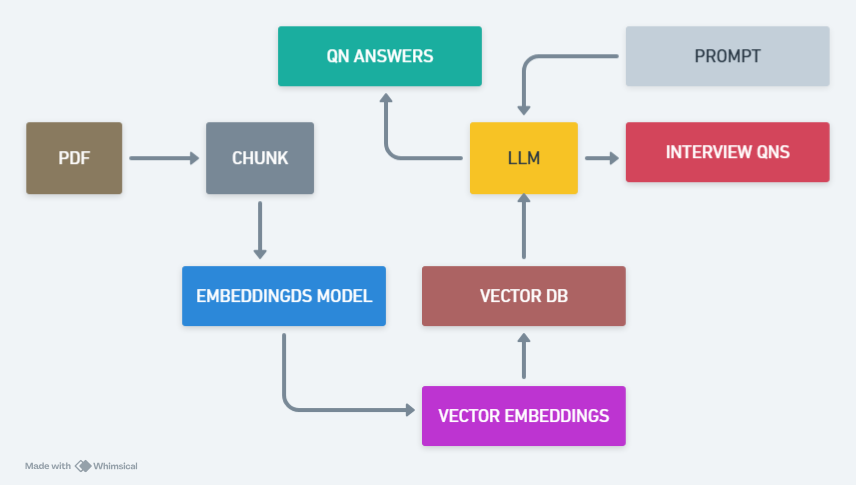

# Interview-Question-Creator



## Overview

The Interview-Question-Creator is an AI-powered system designed to generate relevant interview questions based on document content. This tool helps streamline the interview preparation process by automatically extracting knowledge from documents and creating targeted questions.

## Workflow

The system follows these key steps:

1. **PDF Processing**: Source documents are ingested in PDF format
2. **Chunking**: Documents are broken down into manageable chunks for processing
3. **Embedding**: Chunks are transformed into vector embeddings using an embedding model
4. **Vector Storage**: The embeddings are stored in a vector database for efficient retrieval
5. **LLM Integration**: A Large Language Model processes inputs from chunks, prompts, and the vector database
6. **Question Generation**: The system produces two types of outputs:
   - General QA responses
   - Specific interview questions

## Project Structure

```
Interview-Question-Creator/
├── Generative_AI_project.egg-info/  # Package information
├── research/                        # Research and experimental code
├── src/                             # Source code
├── .env                             # Environment variables
├── app.py                           # Main application
├── requirements.txt                 # Dependencies
├── setup.py                         # Package setup configuration
├── template.py                      # Templates for prompts or outputs
└── workflow.png                     # Workflow diagram
```

## Installation

1. Clone the repository
```bash
git clone https://github.com/yourusername/Interview-Question-Creator.git
cd Interview-Question-Creator
```

2. Create and activate a virtual environment
```bash
python -m venv interview
source interview/bin/activate  # Linux/Mac
# OR
interview\Scripts\activate     # Windows
```

3. Install dependencies
```bash
pip install -r requirements.txt
pip install -e .  # Install as editable package
```

## Usage

1. Configure your environment variables in the `.env` file:
```
API_KEY=your_llm_api_key
VECTOR_DB_CONNECTION=your_vector_db_connection_string
```

2. Run the application:
```bash
python app.py
```

## Features

- **Document Analysis**: Extract relevant information from PDF documents
- **Semantic Understanding**: Use embeddings to capture the semantic meaning of content
- **Context-Aware Questions**: Generate questions that reflect the actual content of documents
- **Customizable Prompts**: Tailor the question generation process using prompt templates
- **Vector Search**: Efficiently retrieve relevant content for generating targeted questions

## Requirements

See `requirements.txt` for a complete list of dependencies.

Key dependencies include:
- LLM integration libraries
- PDF processing tools
- Vector embedding models
- Vector database clients

## Development

The project uses a modular architecture for flexibility and maintainability:
- Document processing pipeline
- Embedding generation service
- Vector database integration
- LLM prompt engineering
- Question generation templates

## Contact

Email: kasasatrevor25@gmail.com  
GitHub: [github.com/kasasa22](https://github.com/kasasa22)